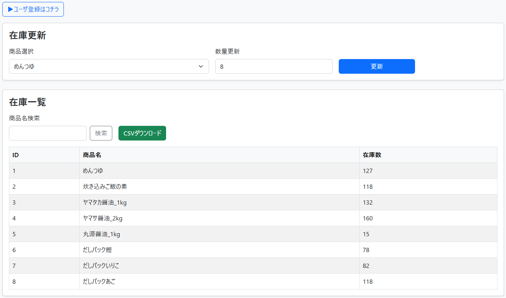

# Spring Boot 在庫管理アプリ

## 📌 概要

本アプリは、商品在庫を管理するためのWebアプリケーションです。
Spring Bootを用いて開発し、認証機能を含む実務レベルを意識した構成で実装しています。

---

## 🎯 作成目的

* Web開発案件へのアサインを見据え、実務を意識したアプリ開発
* Spring Boot / MVCアーキテクチャの理解向上
* 認証・DB連携を含めた開発経験の習得

---

## 🛠 使用技術

* Java
* Spring Boot
* Spring Security（ログイン認証）
* Thymeleaf
* PostgreSQL
* HTML / CSS

---

## 💡 主な機能

* 🔐 ログイン機能（Spring Security）
* 📋 在庫一覧表示
* ➕ 商品登録
* ✏️ 商品更新
* 🗑 商品削除

---

## 🖥 画面イメージ

### 在庫管理画面

---

## 📚 工夫した点

* Spring Securityによる認証機能の実装
* MVC構成（Controller / Service / Repository）の分離
* 可読性・保守性を意識した設計

---

## 🔧 今後の改善点

* バリデーション強化
* UI改善（Bootstrap導入）
* テストコード追加

---

## 👤 作成者

kame-ricefield

